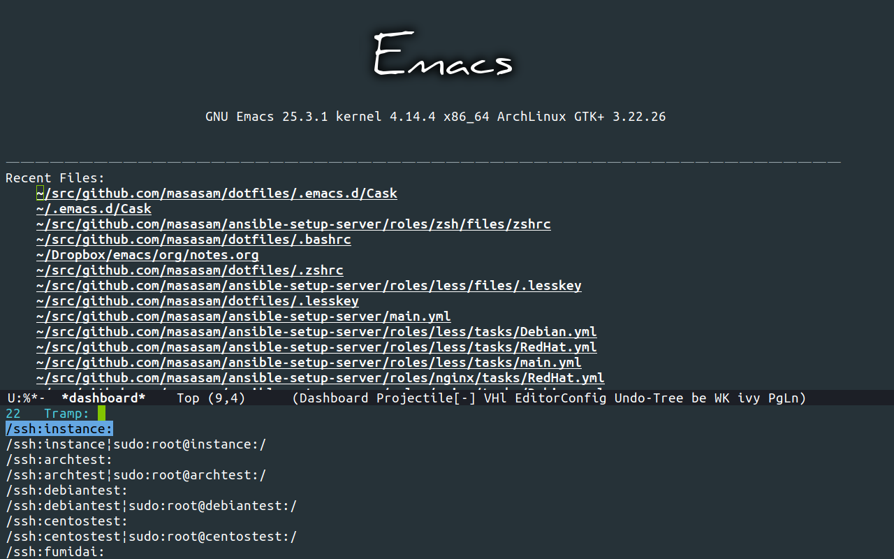
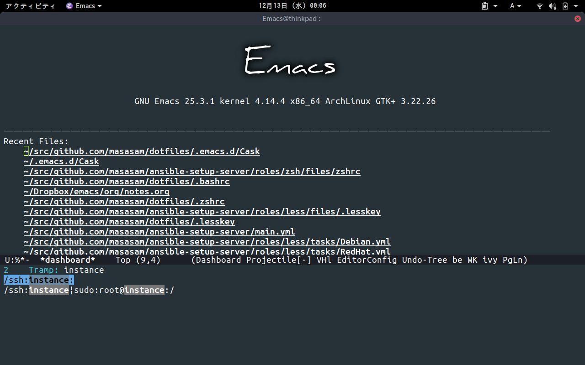
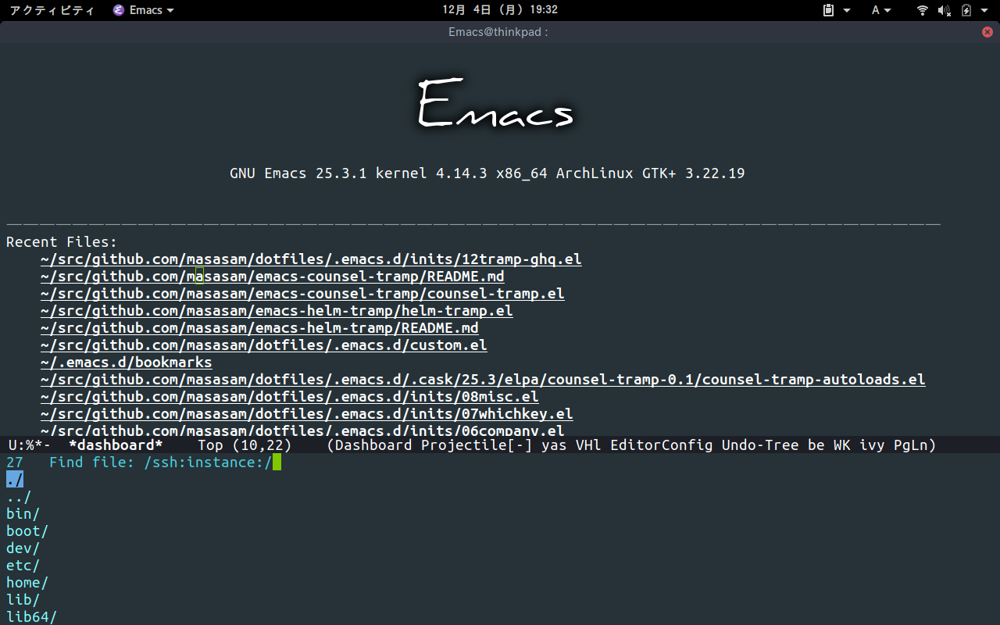
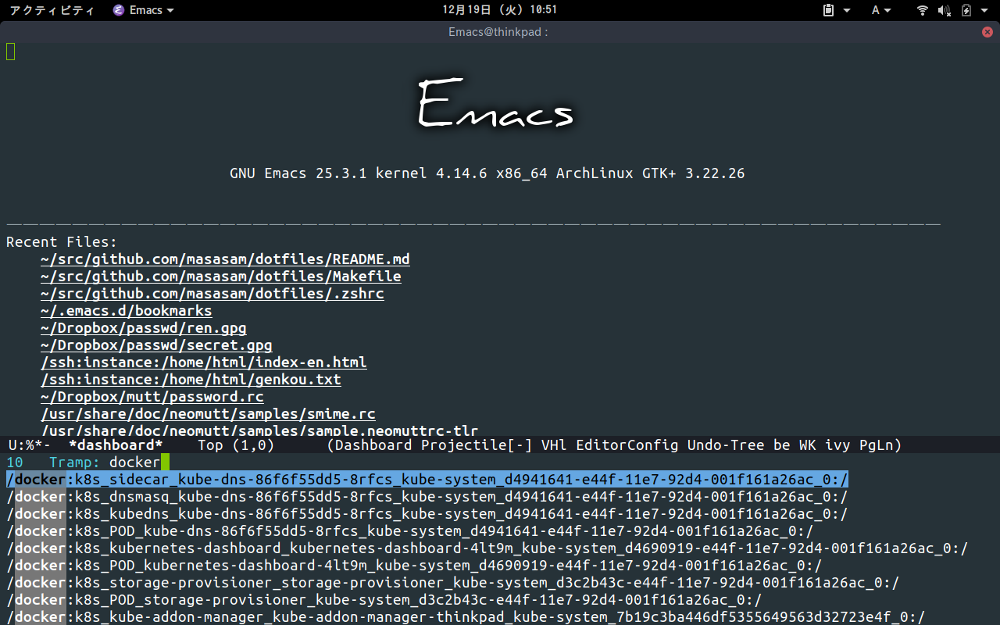

# counsel-tramp [![melpa badge][melpa-badge]][melpa-link] [![melpa stable badge][melpa-stable-badge]][melpa-stable-link]

Tramp ivy interface for ssh server and docker and vagrant

## Screencast

    M-x counsel-tramp

Display server list from your ~/.ssh/config with counsel interface.

Filter by counsel.

You can connect your server with tramp.

Selecting the list with sudo will lead to the server as root.

Selecting the list of '/sudo:root@localhost:/' will open file at localhost as root.

You can edit your server's nginx.conf on your emacs!

If you are using [docker-tramp](https://github.com/emacs-pe/docker-tramp.el), docker is also supplemented

If you are using [vagrant-tramp](https://github.com/dougm/vagrant-tramp), vagrant is also supplemented

You can edit docker container on your emacs!

	counsel-tramp-quit

When you finish editing nginx.conf you clean the tramp buffer with `counsel-tramp-quit` command.

## Requirements

- Emacs 24.3 or higher
- counsel 0.10.0 or higher

## Installation

You can install `counsel-tramp.el` from [MELPA](http://melpa.org) with package.el
(`M-x package-install counsel-tramp`).

You can install `docker-tramp.el` from [MELPA](http://melpa.org) with package.el
(`M-x package-install docker-tramp`).

You can install `vagrant-tramp.el` from [MELPA](http://melpa.org) with package.el
(`M-x package-install vagrant-tramp`).

I recommend you are going to install [exec-path-from-shell]( https://github.com/purcell/exec-path-from-shell).

## Sample Configuration

	(setq tramp-default-method "ssh")
    (define-key global-map (kbd "C-c s") 'counsel-tramp)

## If you want to speed up tramp

	(add-hook 'counsel-tramp-pre-command-hook '(lambda () (global-aggressive-indent-mode 0)
					     (projectile-mode 0)
					     (editorconfig-mode 0)))
	(add-hook 'counsel-tramp-quit-hook '(lambda () (global-aggressive-indent-mode 1)
				      (projectile-mode 1)
				      (editorconfig-mode 1)))

Setting hook that turn off slow extensions when you execute counsel-tramp.

Setting hook that turn on extensions when you execute `counsel-tramp-quit` command.

If you don't make a backup files and lockfiles at remote server, it will be saved faster.

	(setq make-backup-files nil)
	(setq create-lockfiles nil)

## Misc setting

If the shell of the server is zsh it is recommended to connect with bash.

    (eval-after-load 'tramp '(setenv "SHELL" "/bin/bash"))

If you want to specify the user name to connect with docker-tramp.

	(setq counsel-tramp-docker-user "username")

If you want to specify multiple user name list to connect with docker-tramp.

	(setq counsel-tramp-docker-user '("username1" "username2" "username3" "username4"))

If you want to change initial directory when connecting with /sudo:root@localhost:.

	(setq counsel-tramp-localhost-directory "/var")

[melpa-link]: http://melpa.org/#/counsel-tramp
[melpa-badge]: http://melpa.org/packages/counsel-tramp-badge.svg
[melpa-stable-link]: http://stable.melpa.org/#/counsel-tramp
[melpa-stable-badge]: http://stable.melpa.org/packages/counsel-tramp-badge.svg
